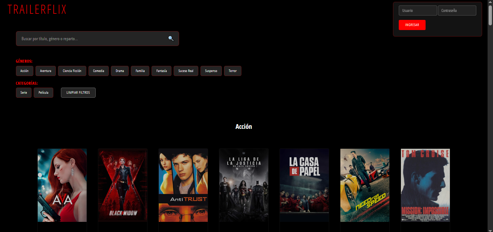
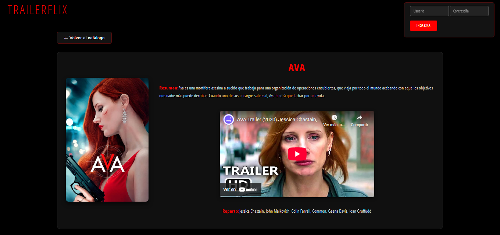

# Trailerflix (Mario Vilche) 🚀

## Descripción del Proyecto

[*Trailerflix* es un visualizardor de tráilers de películas y series inspirado en Netflix, esta creado con Vite y pnpm.]

---

## 🛠️ Instrucciones de Instalación

El proyecto utiliza **pnpm** como gestor de paquetes. Sigue estos pasos para configurar el entorno local:

1.  **Clonar el Repositorio:**
    ```bash
    git clone [https://github.com/MarioVilche/trailerflix-mario.git](https://github.com/MarioVilche/trailerflix-mario.git)
    ```

2.  **Acceder al Directorio del Proyecto:**
    ```bash
    cd trailerflix-mario
    ```

3.  **Instalar Dependencias:**
    Utiliza `pnpm install` para descargar todas las dependencias necesarias:
    ```bash
    pnpm install
    ```

---

## ▶️ Ejecución

Una vez que las dependencias estén instaladas, puedes ejecutar la aplicación con **Vite**:
    ```bash
    pnpm run dev
    ```

La aplicación se abrirá en tu navegador en `http://localhost:[puerto]` (generalmente `3000` o `5173`).

---

## 🖼️ Vistas de la Aplicación

Aquí puedes ver algunas capturas de pantalla de la aplicación.





---
